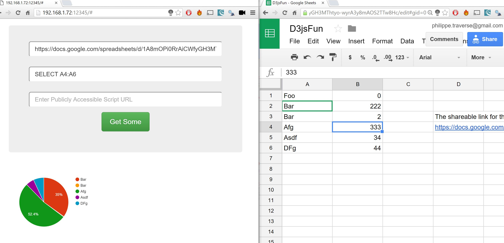
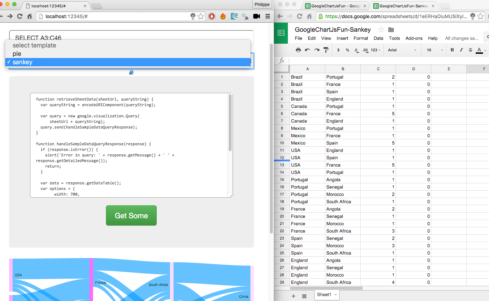
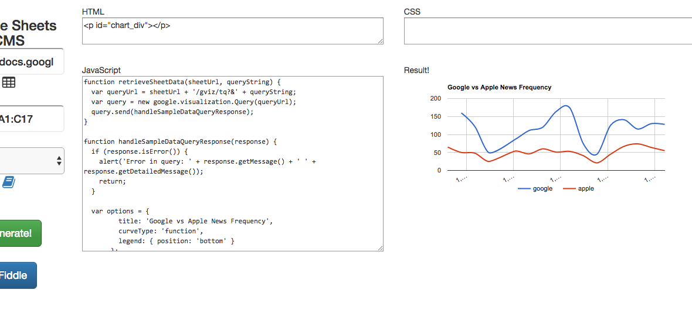

# GS CMS (Google Sheets Content Mgmt System)

### Goals
* Use shareable google drive sheet as source of data
* Allow sheet owner to associate a JS file like with JSFiddle
* Allow sheet owner to be able to write/test their own code
* Allow sheet owner to use shareable links to "link to this report"

### Screenshots




## HOW TO USE WITH GOOGLE BIGQUERY PUBLIC DATASETS:

* Go set your self up with https://console.cloud.google.com/
* In there make a new App with BigQuery enabled and use it at `https://bigquery.cloud.google.com/queries/$APP_ID`
* Compose a bigquery on public datasets
For Example:
Count of words for the last in GDET's daily popular words in media of Apple and Google :
```
SELECT
  apple.date AS date,
  google.c AS google,
  apple.c AS apple
FROM (
 SELECT word, date, c
 FROM [fh-bigquery:public_dump.gdelt_daily_popular_words]
 WHERE word IN ('apple')
 ORDER BY date DESC
 LIMIT 16
) AS apple
LEFT JOIN (
 SELECT word, date, c
 FROM [fh-bigquery:public_dump.gdelt_daily_popular_words]
 WHERE word IN ('google')
 ORDER BY date DESC
 LIMIT 16
) AS google
  ON apple.date = google.date
```

Then use the "save to google sheets" button;

Then within that sheet use the "Share" button to get a shareable URL;

Then use that URL in this app. Easiest way is to clone the repo, add a template to the `templates` folder
using previous entries as examples; Also add new row do `index.jade`'s select dropdown;

## Building a list of stocks

https://gist.github.com/julionc/7476620

`npm run buildstocks` or `yarn run buildstocks`
